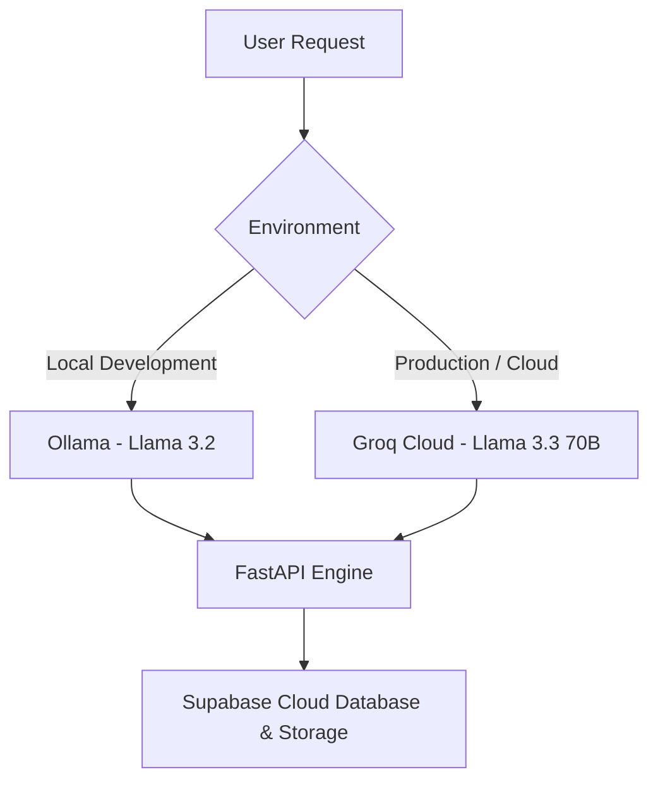

# 🧁 Savoury & Sweet Co. — AI Bakery Assistant
### *A Hybrid Local-First & Production-Grade Conversational Voice Platform*

[](https://savoury-sweet.onrender.com/)
[](https://fastapi.tiangolo.com/)
[](#-dual-environment-engine-ollama--groq)

**Live Production Link:** [savoury-sweet.onrender.com](https://savoury-sweet.onrender.com/)

---

## 🌟 Overview & Architecture Highlight
**Savoury & Sweet Co.** is a hybrid Conversational AI platform engineered to showcase production-grade GenAI patterns. Designed for a boutique bakery, it handles real-time voice and text orders, manages active baskets, and dynamically outputs PDF invoices stored securely in the cloud.

The platform is architected around a dual runtime strategy specifically tailored to balance local developer environments with high-performance production hosting.

---

## ⚡ Dual-Environment Engine (Ollama & Groq)
To showcase operational flexibility and cloud cost-efficiency, the system employs two distinct AI backends:



1. **Local Environment (Offline-First)**: Powered by **Ollama running Llama 3.2** locally on the developer machine. This guarantees zero API costs and full offline functionality during prototyping and feature development.
2. **Production Environment (Global Cloud)**: Hosted live on Render and powered by **Groq Cloud (running Llama 3.3 70B)**. This delivers near-zero latency responses (<500ms token generation), essential for providing a natural, lag-free voice conversational experience.

---

## 🚀 Key Features & Advanced Patterns

*   **Hybrid Telephony Integration**: Ready-to-go webhook integration with **Twilio Voice** for handling inbound phone calls with dynamic real-time speech responses.
*   **Dual Speech Transcription Systems**:
    *   *High-Accuracy Cloud Mode*: Integrates with **OpenAI Whisper** (`whisper-1`) with specific hints tuned for multilingual Indian English and Hindi vocabularies.
    *   *Free Client-Side Fallback*: Employs browser-native Web Speech APIs (`SpeechRecognition` & `SpeechSynthesis`) to ensure 100% uptime and zero API reliance if credentials are not configured.
*   **Structured PDF Invoicing**: Leverages `ReportLab` to construct dynamic invoice documents containing structured tables, exact item quantities, subtotals, and totals.
*   **Cloud Infrastructure**: Fully integrated with **Supabase** for database management and persistent cloud PDF object storage.

---

## 🛠️ Tech Stack & Services
*   **Framework**: FastAPI (Python)
*   **Database & Object Storage**: Supabase
*   **AI Providers**: Groq API (Production) & Ollama (Local Development)
*   **Orchestration & Tools**: ReportLab (PDF compiler), Jinja2 (HTML Templates), Twilio SDK
*   **Hosting**: Render (Live Environment)

---

## 📦 Installation & Setup

### Prerequisites
*   **Python 3.8+**
*   **Ollama**: Install locally from [ollama.com](https://ollama.com/) if testing the offline engine.
*   **Supabase Account**: Set up a bucket named `SweetInvoice` and an `orders` table.

### Local Setup
1.  **Clone the Repository**:
    ```bash
    git clone https://github.com/Sanjana/Savoury-Sweet.git
    cd Savoury-Sweet-main
    ```

2.  **Install Required Libraries**:
    ```bash
    pip install -r requirements.txt
    ```

3.  **Environment Variables (`.env`)**:
    Create a `.env` file in the root directory:
    ```env
    SUPABASE_URL=your-supabase-project-url
    SUPABASE_KEY=your-supabase-anon-key
    AI_PROVIDER=ollama   # Set to 'groq' for cloud mode
    OLLAMA_MODEL=llama3.2
    GROQ_API_KEY=your-groq-api-key
    OPENAI_API_KEY=your-openai-api-key # Optional: For Whisper transcription
    PORT=8000
    ```

4.  **Pull Local Model**:
    ```bash
    ollama pull llama3.2
    ```

---

## 🕹️ How to Run & Verify

### 1. Launch FastAPI Server
```bash
python main.py
```
The application will spin up locally on `http://localhost:8000`.

### 2. Testing the Live Cloud Environment
Open [savoury-sweet.onrender.com](https://savoury-sweet.onrender.com/) in your web browser:
*   Use the **Microphone** button to talk to the AI Assistant.
*   The system uses the client-side Web Speech fallback for voice recognition and replies through speech synthesis.
*   Complete an order by adding items like "Chocolate Cake" or "Samosa", say "yes" to confirm, and provide your name to generate a cloud-stored invoice receipt.

### 3. Twilio Telephony Setup
1. Expose your port using ngrok:
   ```bash
   ngrok http 8000
   ```
2. Configure your Twilio number voice webhook to POST to:
   `https://<your-ngrok-subdomain>.ngrok-free.app/voice`

---

## 🤝 Contributing
Contributions are highly welcome. Feel free to open issues or submit pull requests for optimizations to the prompt handler, speech latency, or UX additions.

1. Fork the Project.
2. Create your Feature Branch (`git checkout -b feature/AmazingFeature`).
3. Commit your changes (`git commit -m 'Add some AmazingFeature'`).
4. Push to the Branch (`git push origin feature/AmazingFeature`).
5. Open a Pull Request.

---

## 📄 License
This project is licensed under the MIT License.

---

## ✉️ Contact & Project Maintenance
*   **Project Link**: [https://savoury-sweet.onrender.com/](https://savoury-sweet.onrender.com/)
*   **Contact Email**: support@savourysweet.co
