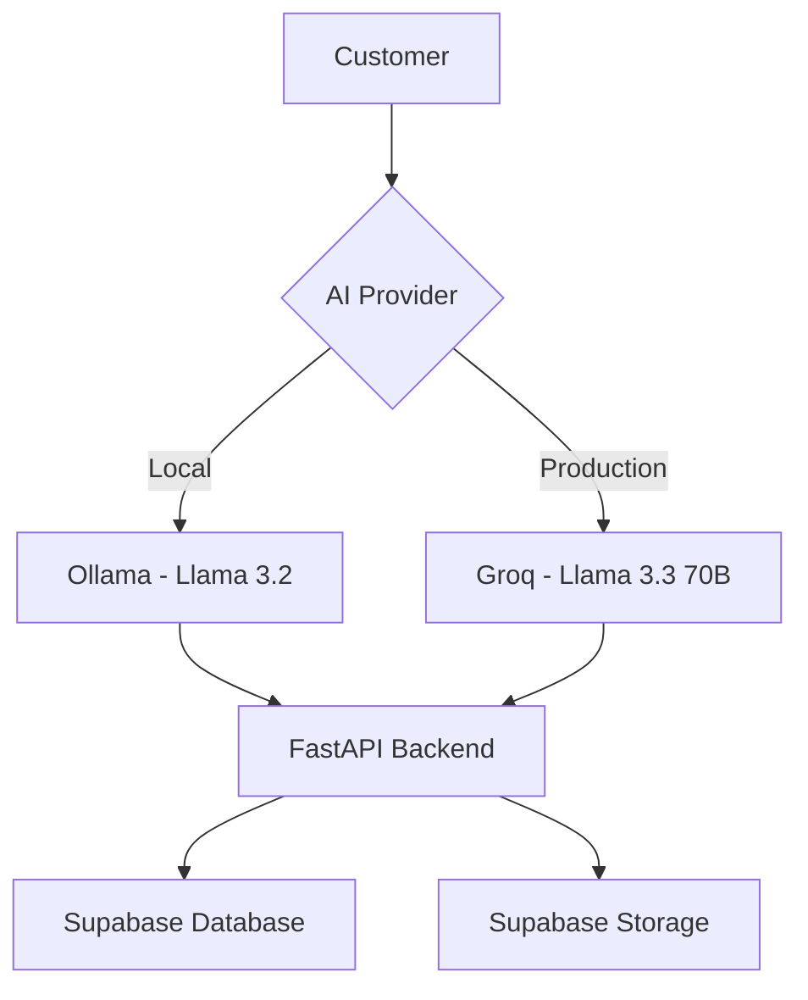
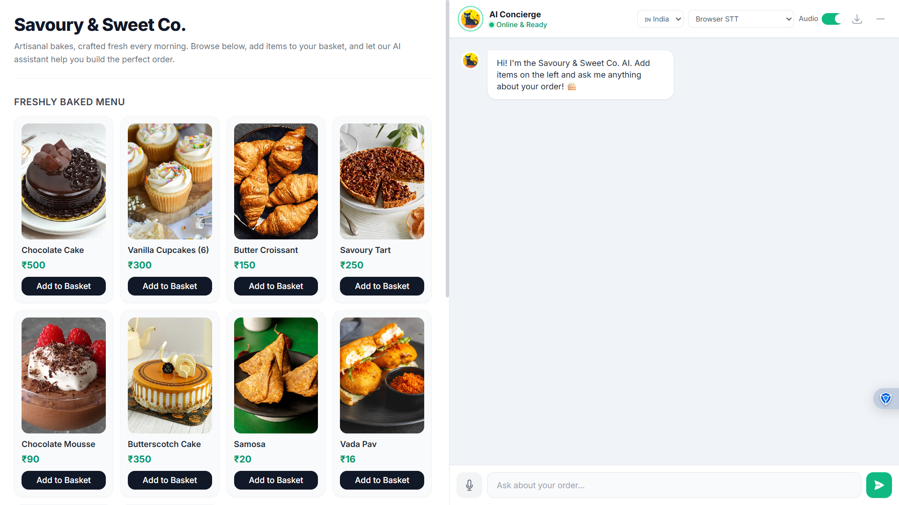
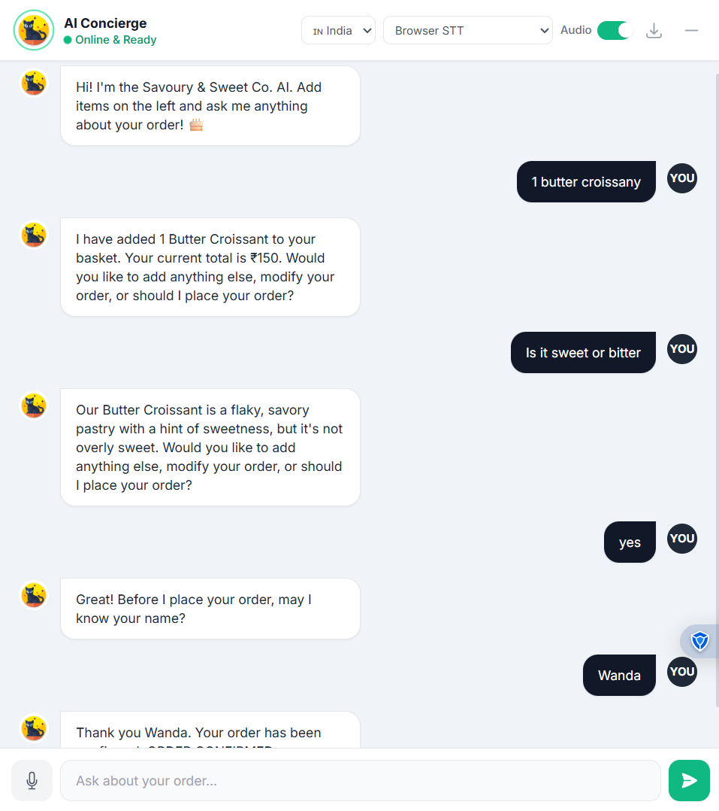
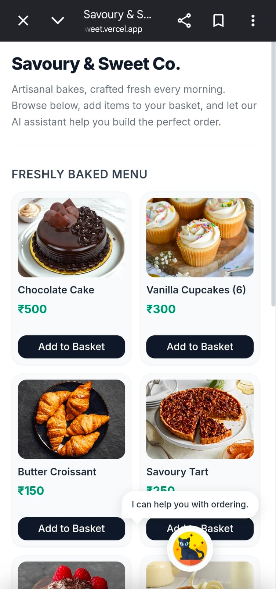
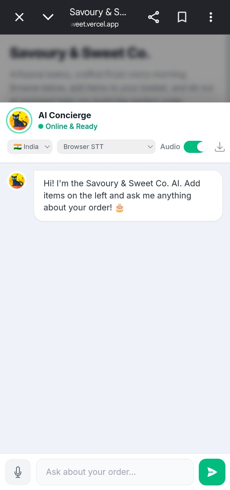
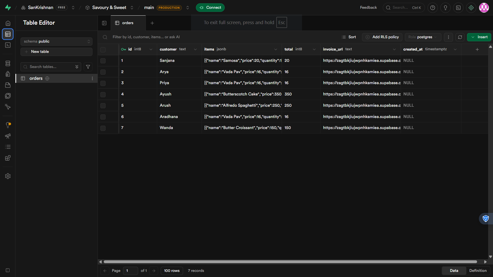
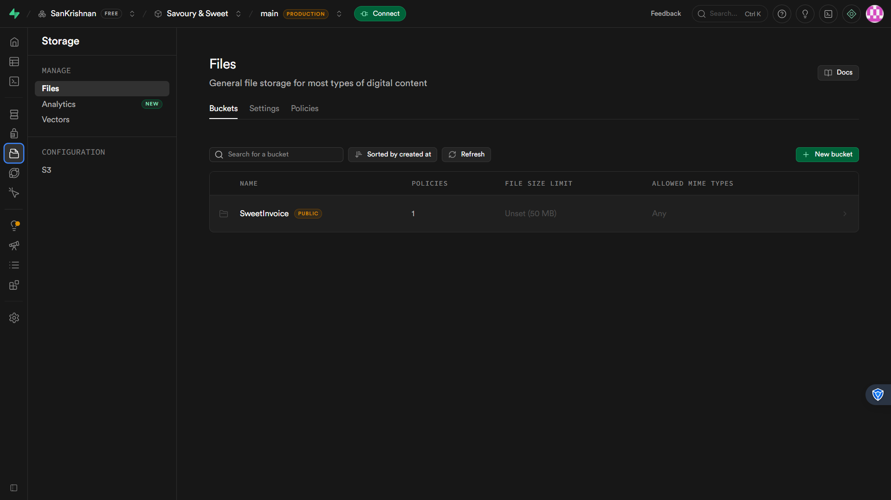
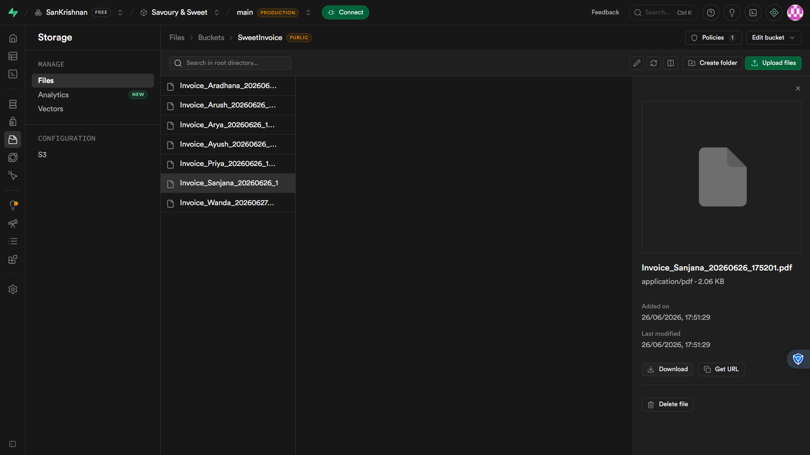

# 🧁 Savoury & Sweet Co. — AI Bakery Assistant

### *A Hybrid Local-First & Production-Grade Conversational AI Ordering Platform*

[](https://savoury-sweet.vercel.app/)
[](https://fastapi.tiangolo.com/)
[](#-dual-environment-engine)

**🌐 Live Demo:** https://savoury-sweet.vercel.app/

---

# 🌟 Overview

**Savoury & Sweet Co.** is an AI-powered conversational bakery ordering platform that enables customers to browse a bakery menu, place orders using natural language or voice, and automatically generate invoices stored securely in the cloud.

The application combines modern web technologies with Large Language Models to provide a natural ordering experience across desktop and mobile devices.

---

# ⚡ Dual-Environment AI Engine

To balance offline development and cloud deployment, the application supports two AI providers.



### Local Development

* Ollama
* Llama 3.2
* Offline development
* Zero API cost

### Production

* Groq API
* Llama 3.3 70B
* Fast inference
* Cloud hosted

---

# 🚀 Features

### 🤖 AI Ordering Assistant

* Conversational food ordering
* Natural language understanding
* Voice-enabled ordering
* Multi-turn conversations
* Dynamic shopping basket

### 🍰 Intelligent Product Assistant

The AI can answer questions such as:

* How does Chocolate Cake taste?
* Is the Alfredo Spaghetti spicy?
* What does the Butterscotch Cake look like?
* Which item would you recommend?

It provides natural descriptions of menu items, flavours, textures, ingredients, and recommendations to help customers decide before ordering.

---

### 🛒 Smart Cart Management

Supports conversational commands like:

* Add 2 Chocolate Cakes
* Remove Samosa
* Keep only one Butter Croissant
* Clear Basket
* Modify quantities

The basket updates dynamically in real time.

---

### 🎤 Voice Interaction

Supports

* Browser Speech Recognition
* Browser Speech Synthesis
* OpenAI Whisper (optional)
* Voice replies from the AI assistant

---

### 📄 Invoice Generation

After confirmation, the application

* Generates a PDF invoice using ReportLab
* Uploads the invoice to **Supabase Storage**
* Stores order details in the **Supabase Orders Table**
* Returns a public invoice URL

---

### ☁️ Cloud Storage

Supabase is used for

* Orders Table
* Invoice Storage Bucket
* Public Invoice URLs

---

### 📱 Responsive Interface

The interface is fully responsive and optimized for

* Desktop
* Tablets
* Mobile Phones

Customers can browse the menu, interact with the AI assistant, and place orders seamlessly across different screen sizes.

---

# 🛠 Tech Stack

### Frontend

* HTML5
* CSS3
* JavaScript
* Tailwind CSS

### Backend

* FastAPI
* Python

### AI

* Groq API
* Ollama
* Llama 3.2
* Llama 3.3 70B

### Cloud

* Supabase Database
* Supabase Storage

### Utilities

* ReportLab
* Jinja2
* Python Speech APIs

### Deployment

* Vercel (Frontend)
* Render / FastAPI Backend
* Supabase

---

# 📦 Installation

## Clone Repository

```bash
git clone https://github.com/SanKrishnan/Savoury-Sweet.git
cd Savoury-Sweet
```

## Install Dependencies

```bash
pip install -r requirements.txt
```

## Create a `.env`

```env
SUPABASE_URL=YOUR_URL
SUPABASE_KEY=YOUR_KEY

AI_PROVIDER=groq

GROQ_API_KEY=YOUR_KEY

OLLAMA_MODEL=llama3.2

OPENAI_API_KEY=YOUR_KEY
```

---

## Run

```bash
python main.py
```

Open

```
http://localhost:8000
```

---

# 🧪 Try It

Ask the assistant things like

* Add two Chocolate Cakes
* Remove the Samosa
* Keep only one Vada Pav
* How does the Butterscotch Cake taste?
* What does the Alfredo Spaghetti look like?
* Which dessert do you recommend?
* Place my order

---

# ☁️ Deployment

Frontend

* Vercel

Backend

* FastAPI on Render

Database & Storage

* Supabase

---

# 📷 Screenshots

## 🏠 Homepage



---

## 🤖 AI Conversation



---

## 📱 Mobile Homepage



---

## 💬 Mobile AI Chat



---

## 📋 Orders Stored in Supabase Table



---

## 🗂️ Invoice Stored in Supabase Storage



---

## 🧾 Orders Database



---

# 🤝 Contributing

Contributions are welcome.

1. Fork the repository
2. Create a feature branch
3. Commit your changes
4. Push your branch
5. Open a Pull Request

---

# 📄 License

Licensed under the MIT License.
